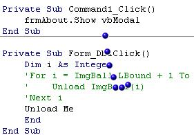

## UPDATED Advanced API \- Cool bouncing balls that follow your mouse cursor everywhere\!

### Description

This creates 7 bouncing balls that follow your cursor around the screen. The balls behave as if joined together with an elastic band - they stretch and bounce of the edges of the screen while following the pointer. Full source code is included. Based on the JavaScript to VB port by Chun Meng. This creates transparent windows shaped like blue balls, that are on top of everything - menus, windows even the taskbar. It's hard to explain or show in the screenshot,but please download and take a look. You will NOT be disappointed!!!!!
 
### More Info
 

             |
---                |---
**Submitted On**   |2002-11-09 17:33:00
**By**             |[jbay101](https://github.com/Planet-Source-Code/PSCIndex/blob/master/ByAuthor/jbay101.md)
**Level**          |Intermediate
**User Rating**    |4.5 (36 globes from 8 users)
**Compatibility**  |VB 3\.0, VB 4\.0 \(16\-bit\), VB 4\.0 \(32\-bit\), VB 5\.0, VB 6\.0
**Category**       |[Complete Applications](https://github.com/Planet-Source-Code/PSCIndex/blob/master/ByCategory/complete-applications__1-27.md)
**World**          |[Visual Basic](https://github.com/Planet-Source-Code/PSCIndex/blob/master/ByWorld/visual-basic.md)
**Archive File**   |[UPDATED\_Ad14957811112002\.zip](https://github.com/Planet-Source-Code/jbay101-updated-advanced-api-cool-bouncing-balls-that-follow-your-mouse-cursor-everywhere__1-40548/archive/master.zip)

